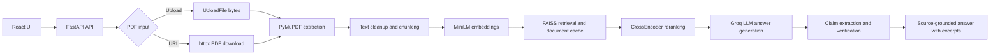

# Intelligent Document Query Engine — Full-Stack RAG Document QA Platform

Live demo: https://shreerangss-intelligent-document-query-engine.hf.space/

GitHub repo: https://github.com/Shreerang4/Intelligent-Document-Query-Engine-RAG

## Overview

Intelligent Document Query Engine is a full-stack PDF question-answering platform deployed as a Hugging Face Docker Space. It combines a React/Vite frontend with a FastAPI backend that ingests PDFs from either a public URL or a local upload, extracts text with PyMuPDF, builds an in-memory vector index, retrieves and reranks relevant chunks, and asks Groq to generate source-grounded answers.

FastAPI serves both the API and the built React app from the same container in production. The live UI supports entering a bearer token, choosing PDF URL or upload mode, submitting one question per line, checking backend health, and reviewing answers with page/chunk source excerpts and claim verification details.

## Features

- React/Vite single-page UI for PDF URL ingestion and PDF upload.
- FastAPI API with bearer-token protection for query endpoints.
- PDF download with content-type and size validation.
- PDF upload validation by MIME type or `.pdf` filename.
- PyMuPDF text extraction with cleanup for low-value extraction artifacts.
- Page-aware text chunking with `RecursiveCharacterTextSplitter` using 500-character chunks and 50-character overlap.
- MiniLM embeddings through `langchain-huggingface`, defaulting to `all-MiniLM-L6-v2`.
- In-memory FAISS `IndexFlatL2` vector search.
- In-memory document cache for URL and upload inputs, with TTL/LRU eviction and cache status response headers.
- CrossEncoder reranking, defaulting to `cross-encoder/ms-marco-TinyBERT-L-2-v2`.
- Groq LLM answer generation, defaulting to `llama-3.1-8b-instant`.
- Source-grounded answer response with page number, chunk id, and excerpts.
- Claim extraction and claim verification against retrieved evidence.
- `/health` endpoint reporting cache size and lazy-loaded model/client status.
- FastAPI static serving for the built frontend under `/` and `/assets`.

## Architecture Flow

`React UI → FastAPI API → PDF upload/URL ingestion → PyMuPDF extraction → chunking → MiniLM embeddings → FAISS retrieval/cache → CrossEncoder reranking → Groq LLM → source-grounded answer`



## Tech Stack

- Frontend: React 18, Vite 5, plain CSS.
- Backend: FastAPI, Uvicorn, Pydantic, python-dotenv.
- PDF processing: PyMuPDF.
- Retrieval: LangChain text splitter, `langchain-huggingface`, Sentence Transformers, FAISS CPU, NumPy.
- Reranking: Sentence Transformers CrossEncoder.
- LLM: Groq Python SDK.
- HTTP/PDF URL fetch: httpx.
- Deployment: Docker multi-stage build, Hugging Face Docker Space on port `7860`.

## Project Structure

```text
.
├── Dockerfile
├── README.md
├── main.py
├── requirements.txt
├── start.py
├── frontend/
│   ├── .env.example
│   ├── index.html
│   ├── package.json
│   ├── package-lock.json
│   ├── vite.config.js
│   └── src/
│       ├── App.jsx
│       ├── App.css
│       ├── index.css
│       └── main.jsx
├── .dockerignore
├── .gitignore
├── FILE_TREE.txt
└── MANIFEST.md
```

## Environment Variables

Backend variables referenced by the code:

| Variable | Required | Default | Purpose |
| --- | --- | --- | --- |
| `API_TOKEN` | Yes | none | Bearer token required by `/hackrx/run` and `/hackrx/upload-run`. |
| `GROQ_API_KEY` | Yes | none | Used by the Groq SDK when `Groq()` is created for answer generation and claim verification. |
| `PORT` | No | `7860` | Uvicorn port used by `start.py`. |
| `MAX_PDF_BYTES` | No | `15728640` | Maximum PDF size in bytes. |
| `HTTP_TIMEOUT_SECONDS` | No | `30` | Timeout for PDF URL downloads. |
| `RETRIEVAL_K_INITIAL` | No | `8` | Initial FAISS retrieval count before reranking. |
| `RETRIEVAL_K_FINAL` | No | `3` | Final chunk count after reranking. |
| `MAX_CONCURRENT_QUESTIONS` | No | `4` | Concurrent question processing limit. |
| `DOCUMENT_CACHE_MAX_ITEMS` | No | `8` | Maximum number of cached document indexes. |
| `DOCUMENT_CACHE_TTL_SECONDS` | No | `3600` | Document cache TTL in seconds. |
| `EMBEDDING_MODEL_NAME` | No | `all-MiniLM-L6-v2` | Hugging Face embedding model name. |
| `RERANKER_MODEL_NAME` | No | `cross-encoder/ms-marco-TinyBERT-L-2-v2` | CrossEncoder reranker model name. |
| `LLM_MODEL_NAME` | No | `llama-3.1-8b-instant` | Groq model name. |

Frontend variable from `frontend/.env.example` and `frontend/src/App.jsx`:

| Variable | Required | Default | Purpose |
| --- | --- | --- | --- |
| `VITE_API_BASE_URL` | No | same origin | Optional API base URL for local Vite development. The example file points to `http://127.0.0.1:8000`; use the port where your backend is running. |

## Local Development

### Backend

```powershell
py -m venv .venv
.venv\Scripts\Activate.ps1
pip install --upgrade pip
pip install torch --index-url https://download.pytorch.org/whl/cpu
pip install -r requirements.txt
$env:GROQ_API_KEY="your_groq_api_key"
$env:API_TOKEN="your_local_api_token"
$env:PORT="7860"
py start.py
```

The backend will be available at `http://127.0.0.1:7860`.

### Frontend

```powershell
cd frontend
copy .env.example .env
npm install
npm run dev
```

For local Vite development, set `VITE_API_BASE_URL` in `frontend/.env` to the backend URL, for example `http://127.0.0.1:7860` if you use `py start.py`.

## Docker / Hugging Face Spaces Deployment

The Dockerfile builds the frontend with Node 20, then creates a Python 3.11 runtime image. It installs `libgomp1`, CPU-only PyTorch, Python dependencies, copies the app, copies the built frontend into `frontend/dist`, exposes port `7860`, and runs `python start.py`.

Build and run locally:

```powershell
docker build -t intelligent-document-query-engine .
docker run --rm -p 7860:7860 `
  --env GROQ_API_KEY=your_groq_api_key `
  --env API_TOKEN=your_api_token `
  intelligent-document-query-engine
```

For Hugging Face Spaces:

- Use the Docker SDK.
- Configure `GROQ_API_KEY` and `API_TOKEN` as Space secrets.
- Keep `app_port: 7860` in the README front matter.
- The built React frontend is served by FastAPI from the same origin.

## API Endpoints

### `POST /hackrx/run`

Runs the RAG pipeline against a PDF available by URL.

Headers:

```http
Authorization: Bearer <API_TOKEN>
Content-Type: application/json
```

Request body:

```json
{
  "documents": "https://example.com/document.pdf",
  "questions": [
    "What is this document about?",
    "What are the key exclusions?"
  ]
}
```

### `POST /hackrx/upload-run`

Runs the RAG pipeline against an uploaded PDF.

Headers:

```http
Authorization: Bearer <API_TOKEN>
```

Multipart form fields:

- `file`: PDF file upload.
- `questions_json`: JSON array of question strings.

### `GET /health`

Returns service status, app version, cache entry count, and whether the embedding model, reranker, and Groq client have been loaded.

Example fields:

```json
{
  "status": "healthy",
  "version": "2.3.0",
  "cache_entries": 0,
  "embedding_model_loaded": false,
  "reranker_loaded": false,
  "groq_client_loaded": false
}
```

### Frontend Routes

- `GET /`: serves `frontend/dist/index.html` when the frontend has been built.
- `GET /assets/*`: serves built frontend assets.
- `GET /{full_path:path}`: supports SPA fallback for non-API paths.

## Security Notes

- Do not commit `.env`, `.env.local`, or real API keys.
- Store `GROQ_API_KEY` and `API_TOKEN` as Hugging Face Space secrets in production.
- Query endpoints require `Authorization: Bearer <API_TOKEN>`.
- The frontend asks the user to paste the bearer token; it is sent with requests but is not stored in the codebase.
- The document cache is in-memory only and is keyed by a SHA-256 hash of the URL or uploaded PDF bytes.
- The URL ingestion endpoint downloads remote PDFs from caller-provided URLs, so deployment environments should consider network egress and SSRF risk policies.

## Limitations / Future Work

- Automated tests are not currently present in the repository.
- The cache is process-local memory and is cleared on container restart.
- PDF extraction depends on embedded text; scanned/image-only PDFs are not OCR-processed by this code.
- FAISS indexes are rebuilt per uncached document and are not persisted to disk.
- There is no user account system or per-user document isolation in the current code.
- The frontend uses a manually entered bearer token rather than an authenticated session flow.

## Testing

No automated test files are currently present. Although pytest dependencies are listed in `requirements.txt`, automated tests are planned rather than implemented.

Manual smoke checks:

```powershell
py start.py
```

Then open `http://127.0.0.1:7860/health` or use the React UI after building the frontend.
