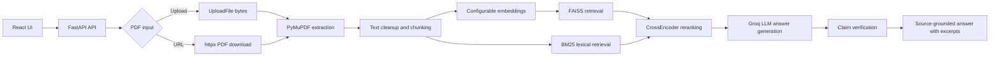

# Intelligent Document Query Engine - Full-Stack RAG Document QA

Live demo: https://shreerangss-intelligent-document-query-engine.hf.space/

GitHub repo: https://github.com/Shreerang4/Intelligent-Document-Query-Engine-RAG

## Overview

Intelligent Document Query Engine is a full-stack PDF RAG application with an evaluated retrieval pipeline. It combines a React/Vite frontend with a FastAPI backend that ingests PDFs from a URL or upload, chunks extracted text, retrieves relevant evidence, reranks it, and asks Groq to generate source-grounded answers with page/chunk citations and claim verification.

The GitHub repo now defaults to E5-small-v2 for retrieval quality. MiniLM remains selectable through `EMBEDDING_MODEL_NAME` for speed/cost comparison, and the Hugging Face live demo may lag behind this repo until the Space is manually synced.

## Features

- React/Vite UI for PDF URL ingestion and PDF upload.
- FastAPI API with bearer-token protection for query endpoints.
- PDF validation, download/upload handling, and PyMuPDF text extraction.
- Page-aware chunking with 500-character chunks and 50-character overlap.
- Configurable embeddings through `EMBEDDING_MODEL_NAME`.
- E5-small-v2 default: `intfloat/e5-small-v2` with correct `passage:` and `query:` prefixes.
- MiniLM fallback/baseline: `all-MiniLM-L6-v2`.
- In-memory FAISS vector search and embedding-aware document cache keys.
- BM25 and E5+BM25 hybrid retrieval experiments behind `RETRIEVAL_MODE`.
- CrossEncoder reranking, defaulting to `cross-encoder/ms-marco-TinyBERT-L-2-v2`.
- Groq LLM answer generation, defaulting to `llama-3.1-8b-instant`.
- Source-grounded responses with page number, chunk id, and excerpts.
- Claim extraction and verification against retrieved evidence.
- Retrieval evaluation harness with benchmark reports and targeted probes.

## Architecture

`React UI -> FastAPI API -> PDF upload/URL ingestion -> PyMuPDF extraction -> chunking -> configurable embeddings -> FAISS/BM25 retrieval experiments -> CrossEncoder reranking -> Groq LLM -> source-grounded answers + claim verification`



## Retrieval Evaluation

The retrieval pipeline was evaluated on a fixed financial-document benchmark:

- 33 labeled questions across Infosys, HDFC Bank, and Bajaj Finance annual reports.
- Question types: lexical, paraphrase, conceptual, and distractor.
- Metrics: Recall@3, Recall@5, MRR, needs_review count, retrieval latency, and ingestion/indexing time.
- Evaluation mode: retrieval-only, no LLM answer generation.

Final retrieval metrics:

| Configuration | R@3 | R@5 | MRR | needs_review | p50 | p95 | ingest/index time |
| --- | ---: | ---: | ---: | ---: | ---: | ---: | ---: |
| MiniLM | 54.2% | 62.5% | 0.474 | 7 | 56 ms | 144 ms | 230.8s |
| E5-small-v2 | 58.3% | 70.8% | 0.496 | 4 | 73 ms | 156 ms | 534.0s |
| E5+BM25 hybrid | 58.3% | 70.8% | 0.504 | 5 | 216 ms | 527 ms | 510.0s |

Decision summary:

- E5-small-v2 improves retrieval quality over the MiniLM baseline, raising R@5 from 62.5% to 70.8% and reducing needs_review from 7 to 4.
- E5-small-v2 is especially helpful on paraphrase and conceptual questions.
- E5+BM25 hybrid rescued one exact table case but did not improve R@5, increased needs_review from 4 to 5, and tripled p50 retrieval latency, so it remains a documented ablation rather than the default.
- Larger embedding candidates were rejected for this environment: GTE was slower and worse than E5, and Qwen3-0.6B CPU ingestion was impractically slow.
- Remaining misses are documented limitations around table extraction, candidate-pool size, reranker ordering, and benchmark hit criteria.

See [docs/retrieval_evaluation.md](docs/retrieval_evaluation.md) for the detailed evaluation summary.

## Configuration

Backend variables referenced by the code:

| Variable | Required | Default | Purpose |
| --- | --- | --- | --- |
| `API_TOKEN` | Yes | none | Bearer token required by `/hackrx/run` and `/hackrx/upload-run`. |
| `GROQ_API_KEY` | Yes | none | Used by the Groq SDK for answer generation and claim verification. |
| `PORT` | No | `7860` | Uvicorn port used by `start.py`. |
| `MAX_PDF_BYTES` | No | `15728640` | Maximum PDF size in bytes. |
| `HTTP_TIMEOUT_SECONDS` | No | `30` | Timeout for PDF URL downloads. |
| `RETRIEVAL_K_INITIAL` | No | `20` | Initial FAISS retrieval count before reranking in the app path. |
| `RETRIEVAL_K_FINAL` | No | `8` | Final chunk count after reranking in the app path. |
| `RETRIEVAL_MODE` | No | `faiss_reranker` | Retrieval path. Experimental option: `e5_bm25_reranker`. |
| `HYBRID_E5_K_INITIAL` | No | `30` | E5 candidate count for the hybrid experiment. |
| `HYBRID_BM25_K_INITIAL` | No | `20` | BM25 candidate count for the hybrid experiment. |
| `HYBRID_K_FINAL` | No | `5` | Final reranked chunk count for the hybrid experiment. |
| `MAX_CONCURRENT_QUESTIONS` | No | `4` | Concurrent question processing limit. |
| `DOCUMENT_CACHE_MAX_ITEMS` | No | `8` | Maximum number of cached document indexes. |
| `DOCUMENT_CACHE_TTL_SECONDS` | No | `3600` | Document cache TTL in seconds. |
| `EMBEDDING_MODEL_NAME` | No | `intfloat/e5-small-v2` | Hugging Face embedding model name. Set `all-MiniLM-L6-v2` to use the MiniLM fallback/baseline. |
| `RERANKER_MODEL_NAME` | No | `cross-encoder/ms-marco-TinyBERT-L-2-v2` | CrossEncoder reranker model name. |
| `LLM_MODEL_NAME` | No | `llama-3.1-8b-instant` | Groq model name. |

Frontend variable:

| Variable | Required | Default | Purpose |
| --- | --- | --- | --- |
| `VITE_API_BASE_URL` | No | same origin | Optional API base URL for local Vite development. |

## Local Development

Backend:

```powershell
py -m venv .venv
.venv\Scripts\Activate.ps1
pip install --upgrade pip
pip install torch --index-url https://download.pytorch.org/whl/cpu
pip install -r requirements.txt
$env:GROQ_API_KEY="your_groq_api_key"
$env:API_TOKEN="your_local_api_token"
$env:PORT="7860"
py start.py
```

Frontend:

```powershell
cd frontend
copy .env.example .env
npm install
npm run dev
```

For local Vite development, set `VITE_API_BASE_URL` in `frontend/.env` to the backend URL.

## Evaluation Commands

MiniLM baseline:

```powershell
$env:EMBEDDING_MODEL_NAME='all-MiniLM-L6-v2'
.venv\Scripts\python.exe eval\runner.py --no-llm --out eval\results\stage2d_minilm
```

E5-small-v2:

```powershell
$env:EMBEDDING_MODEL_NAME='intfloat/e5-small-v2'
.venv\Scripts\python.exe eval\runner.py --no-llm --out eval\results\stage2d_e5_small_v2
```

E5+BM25 hybrid ablation:

```powershell
$env:EMBEDDING_MODEL_NAME='intfloat/e5-small-v2'
$env:RETRIEVAL_MODE='e5_bm25_reranker'
.venv\Scripts\python.exe eval\runner.py --no-llm --out eval\results\stage2e_e5_bm25_hybrid
```

Generated files under `eval/results/` are ignored by git. Commit lightweight summaries under `docs/` instead.

## Docker / Hugging Face Spaces Deployment

The Dockerfile builds the frontend with Node 20, then creates a Python runtime image. It installs CPU-only PyTorch and Python dependencies, copies the built frontend into `frontend/dist`, exposes port `7860`, and runs `python start.py`.

Build and run locally:

```powershell
docker build -t intelligent-document-query-engine .
docker run --rm -p 7860:7860 `
  --env GROQ_API_KEY=your_groq_api_key `
  --env API_TOKEN=your_api_token `
  intelligent-document-query-engine
```

For Hugging Face Spaces:

- Use the Docker SDK.
- Configure `GROQ_API_KEY` and `API_TOKEN` as Space secrets.
- Keep `app_port: 7860` in the README front matter.
- The built React frontend is served by FastAPI from the same origin.
- This GitHub repo may be ahead of the live Hugging Face Space when the Space has not been manually synced.

## API Endpoints

### `POST /hackrx/run`

Runs the RAG pipeline against a PDF available by URL.

Headers:

```http
Authorization: Bearer <API_TOKEN>
Content-Type: application/json
```

Request body:

```json
{
  "documents": "https://example.com/document.pdf",
  "questions": [
    "What is this document about?",
    "What are the key exclusions?"
  ]
}
```

### `POST /hackrx/upload-run`

Runs the RAG pipeline against an uploaded PDF.

Headers:

```http
Authorization: Bearer <API_TOKEN>
```

Multipart form fields:

- `file`: PDF file upload.
- `questions_json`: JSON array of question strings.

### `GET /health`

Returns service status, app version, cache entry count, and whether the embedding model, reranker, and Groq client have been loaded.

## Security Notes

- Do not commit `.env`, `.env.local`, or real API keys.
- Store `GROQ_API_KEY` and `API_TOKEN` as Hugging Face Space secrets in production.
- Query endpoints require `Authorization: Bearer <API_TOKEN>`.
- Document indexes and model clients are process-local and in memory.
- URL ingestion downloads caller-provided PDFs, so deployment environments should consider network egress and SSRF risk policies.

## Limitations

- Cache is process-local memory and is cleared on container restart.
- PDF extraction depends on embedded text; scanned/image-only PDFs are not OCR-processed.
- FAISS indexes are rebuilt per uncached document and are not persisted to disk.
- There is no user account system or per-user document isolation in the current code.
- The frontend uses a manually entered bearer token rather than an authenticated session flow.
- Retrieval quality is improved but not perfect; remaining misses are documented in the benchmark summary.

## Lightweight Checks

Compile changed Python files:

```powershell
.venv\Scripts\python.exe -m py_compile main.py eval\pipeline_adapter.py eval\runner.py eval\smoke_test.py
```

Run the metric unit tests:

```powershell
.venv\Scripts\python.exe -m pytest eval\test_metrics.py -q
```
