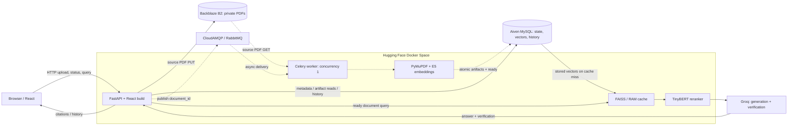

# Intelligent Document Query Engine

A full-stack, multi-user PDF question-answering application with asynchronous ingestion, private documents, and answers linked to page and chunk evidence. Upload a PDF, follow its processing status, then ask questions and review citations and claim-verification results. The React/Vite frontend and FastAPI backend are publicly deployed on a Hugging Face Docker Space.

[Live demo](https://shreerangss-intelligent-document-query-engine.hf.space/)

## Engineering highlights

- **Background ingestion:** RabbitMQ and Celery move PDF parsing and embedding out of the upload HTTP request; the UI polls document status.
- **Durable source and artifacts:** private source PDFs in S3-compatible storage, with document state, chunks, float32 embeddings, and history in MySQL. FAISS can be rebuilt after an API restart from compatible persisted vectors.
- **User isolation:** validated JWT subjects scope document, history, and process-local cache access.
- **Authentication:** Argon2id passwords, short-lived access JWTs held in browser memory, and rotating HttpOnly refresh cookies with browser and database concurrency controls.
- **Upload recovery and user choice:** a per-user request UUID recovers the same upload attempt; content duplicates prompt **Open existing** or **Upload again**.
- **Evaluated retrieval:** E5-small-v2, FAISS, and TinyBERT reranking, compared with MiniLM and an E5+BM25 ablation on a fixed benchmark.
- **Inspectable answers:** Answers generated with Groq include application-selected source excerpts and page/chunk references, with a separate claim-verification pass. These aid review; they do not guarantee factual correctness.

## Production architecture

The current deployment uses Hugging Face for the application container, CloudAMQP for RabbitMQ, Aiven for MySQL, Backblaze B2 for private source PDFs, and Groq for inference. Provider choices are environment configuration; the code uses RabbitMQ, SQLAlchemy/MySQL, and S3-compatible interfaces.


```mermaid
flowchart LR
    Browser["Browser / React"]
    subgraph HF["Hugging Face Docker Space"]
        API["FastAPI + React build"]
        Worker["Celery worker: concurrency 1"]
        Parse["PyMuPDF + E5 embeddings"]
        FAISS["FAISS / RAM cache"]
        Rank["TinyBERT reranker"]
    end
    Objects[("Backblaze B2: private PDFs")]
    DB[("Aiven MySQL: state, vectors, history")]
    Broker["CloudAMQP / RabbitMQ"]
    Groq["Groq: generation + verification"]
    Browser -->|"HTTP upload, status, query"| API
    API -->|"source PDF PUT"| Objects
    API -->|"metadata / artifact reads / history"| DB
    API -.->|"publish document_id"| Broker
    Broker -.->|"async delivery"| Worker
    Objects -.->|"source PDF GET"| Worker
    Worker -.-> Parse
    Parse -.->|"atomic artifacts + ready"| DB
    DB -->|"stored vectors on cache miss"| FAISS
    API -->|"ready document query"| FAISS
    FAISS --> Rank
    Rank --> Groq
    Groq -->|"answer + verification"| API
    API -->|"citations / history"| Browser
```

Solid arrows show HTTP/query/store interactions; dashed arrows show background ingestion. Cylinders are persistent stores. FAISS is an in-memory derivative of persisted embeddings. `production_start.py` supervises the API and worker in one container as a low-cost demo deployment choice. Local Compose runs them as separate services. [Architecture and sequence diagrams](docs/architecture.md) describe the boundaries in detail.

## Upload lifecycle and recovery

`POST /documents/upload` validates the PDF, writes its private source object, commits a `queued` document row, then publishes the `document_id`. The worker marks the document `processing`, reads that object, parses and chunks text, embeds it, and commits chunks, vectors, and `ready` state in one transaction. The source PDF is retained. The broker carries identifiers, **never PDF bytes**; MySQL stores the object key and metadata rather than a PDF blob.

| State | Meaning |
| --- | --- |
| `queued` | Awaiting ingestion, a retry countdown, or recovery of a publication failure. It does not prove a message is present. |
| `processing` | Ingestion has started; a crash can leave this state until redelivery. |
| `ready` | Chunks and embeddings were committed; the owner can query the document. |
| `failed` | A permanent content error or exhausted retry policy was recorded. |

The browser shows processing status, polls `GET /documents/{document_id}`, and enables the question box when ready. Queries use `POST /documents/{document_id}/queries`.

**Request idempotency comes first.** Send a stable `upload_request_id` UUID for every logical upload attempt. Reusing it with the same bytes recovers that user's document; a queued document can be republished. Reusing it with different bytes returns 409. Recovering a failed document does not restart ingestion. The browser retains this ID for retries within the current upload attempt, but does not persist it across a page reload.

**Duplicate content is a separate check.** After request recovery, the API searches that user's documents by SHA-256 of the PDF bytes. It prefers the newest queued/processing match, otherwise the newest ready match, with a document-ID tie-break. Failed matches are ignored. A match returns 409 without a new object, row, or task:

```json
{
  "code": "duplicate_document",
  "document": {
    "document_id": "<existing-document-uuid>",
    "filename": "report.pdf",
    "status": "ready"
  }
}
```

**Open existing** activates the returned document and resumes polling if needed. **Upload again** sends `allow_duplicate=true`, bypassing only the content check. A fresh request UUID creates another document; an already committed UUID still recovers its original document. Matching never crosses users. There is no unique hash constraint: concurrent new attempts with different UUIDs can both pass the content check. Historical duplicates are retained.

**Delivery is at least once, not exactly once.** Late acknowledgements and worker-loss redelivery can repeat a task. A ready document is a no-op on redelivery; locked artifact persistence preserves an already-ready winner. Classified retryable failures are eligible for up to three retries by default, with jittered exponential backoff. Concurrent deliveries can still repeat parsing/embedding work.

**The database-to-broker gap is explicit.** Publisher confirmations do not make a database commit and broker publication atomic. A visible publication failure returns 503 with the authoritative document ID and retains the queued row and source PDF. Retrying the same upload UUID can republish. A hard crash after the row commit but before publication can leave queued work without a message; there is no transactional outbox or automatic reconciler. [Failure and recovery table](docs/failure_modes.md) and [Worker contract](docs/document_ingestion_worker.md).

## Query path

For an owned, ready document, the API loads ordered chunks and float32 embeddings from MySQL on a cache miss and rebuilds an exact FAISS `IndexFlatL2` index. The bounded document cache holds at most 8 entries per API process, expires entries after 3,600 seconds from creation, and evicts least-recently-used entries at capacity. Its keys include the user, document ID, and embedding configuration.

E5 uses `passage: ` prefixes for chunks and `query: ` for questions. Defaults are 500-character chunks with 50-character overlap, `intfloat/e5-small-v2`, 20 initial FAISS candidates, `cross-encoder/ms-marco-TinyBERT-L-2-v2` reranking, and 8 final context chunks. Groq uses `openai/gpt-oss-20b` for generation and the claim-verification pass. Responses include excerpts, page numbers, chunk IDs, and verification verdicts.

Document-query history and citations are written in a **best-effort post-response background task**. An answer can succeed even if its history write fails. The query endpoint does not reparse PDFs or repair incompatible/missing embeddings: those failures return 503. [Persistence schema and legacy-route distinctions](docs/persistence_schema.md).

## Retrieval evaluation

The fixed corpus contains Infosys, HDFC Bank, and Bajaj Finance annual reports: 33 questions, of which 24 are answerable and 9 unanswerable. Answerable categories include lexical, paraphrase, conceptual, and distractor questions. The historical retrieval-only runs below exclude Groq generation; the latency figures are local retrieval measurements, not live HTTP latency or production throughput.

| Configuration | R@3 | R@5 | MRR | needs_review | p50 | p95 | ingest/index time |
| --- | ---: | ---: | ---: | ---: | ---: | ---: | ---: |
| MiniLM | 54.2% | 62.5% | 0.474 | 7 | 56 ms | 144 ms | 230.8s |
| E5-small-v2 | 58.3% | 70.8% | 0.496 | 4 | 73 ms | 156 ms | 534.0s |
| E5+BM25 hybrid | 58.3% | 70.8% | 0.504 | 5 | 216 ms | 527 ms | 510.0s |

E5 improved R@5 over MiniLM and reduced the review set. The hybrid ablation achieved slightly higher MRR and rescued one exact-table case, but did not improve R@5, increased `needs_review`, and raised retrieval latency. E5 remains the default; MiniLM is an explicit configuration alternative, not an automatic failure fallback.

The benchmark is small and fixed. Hit matching accepts a supporting-text substring **or a labeled page**, which can count broad page matches. These results do not establish answer factuality or deployment capacity. [Methodology, model trade-offs, and preserved results](docs/retrieval_evaluation.md).

## Authentication and security

Passwords use Argon2id. Access JWTs default to 10 minutes and stay in frontend memory. A host-only, rotating `idqe_refresh` cookie uses HttpOnly, Secure by default, SameSite=Lax, and `/auth`; only its SHA-256 digest is persisted. Rotation retains the original seven-day expiry.

Same-tab requests share `refreshPromise`; Web Locks serialize refresh dispatch across tabs when supported. InnoDB `SELECT ... FOR UPDATE` is the server correctness layer. User identity comes from the validated JWT subject. Private resources belonging to another user return not found. Auth POSTs check Origin/Referer; credential-bearing successful auth responses use `Cache-Control: no-store`. The served frontend receives a CSP without `unsafe-inline` or `unsafe-eval`.

Bucket privacy, provider credentials, network access, and HTTPS remain deployment responsibilities. Groq receives selected text evidence. There is no signed source-PDF viewing/download endpoint. [Security boundaries and limitations](docs/security.md).

## API surface

Interactive schemas are available at `/docs`. Application routes require a user access JWT unless noted.

| Method and route | Contract |
| --- | --- |
| `POST /auth/register`, `POST /auth/login` | Email/password authentication; access-token JSON and refresh cookie. No access JWT required. |
| `POST /auth/refresh`, `POST /auth/logout` | Rotate or revoke the browser refresh credential; no access JWT required. |
| `GET /auth/me` | Current DB-backed public user. |
| `POST /documents/upload` | Multipart `file` (required), `upload_request_id` (optional UUID; strongly recommended), `allow_duplicate` (boolean, default false). |
| `GET /documents/{document_id}` | `document_id`, `filename`, `status`, `error_message`, `created_at`, `updated_at`. |
| `POST /documents/{document_id}/queries` | JSON `{"question":"..."}`; returns `QueryResponse` with an `answers` list. |
| `POST /hackrx/run` | Legacy synchronous URL path: JSON `documents` URL and `questions` list. |
| `POST /hackrx/upload-run` | Legacy synchronous multipart `file`, `questions_json`, optional `request_id`; separate response-recovery contract. |
| `GET /history/documents` | Owned documents; bounded `limit`. |
| `GET /history/documents/{document_id}/queries` | Owned document's queries; bounded `limit`. |
| `GET /history/queries/{query_id}/citations` | Owned query's citations. |
| `GET /health` | Public process/model/cache information; not a broker/worker/storage readiness probe. |
| `GET /health/db` | DB connectivity diagnostic requiring the separate operational `API_TOKEN`. |

Async upload success returns `{document_id, filename, status}`: 202 for new work or recovered queued/processing work, 200 for recovered ready/failed documents. Invalid PDF input or UUID yields 400; missing/invalid form structure can yield 422. Both content duplication and request-ID reuse with different bytes use 409, but only the former has `code: duplicate_document`; the latter uses `detail`. Infrastructure errors use 503 with `message` and optional `document_id`/`status`. Object keys and infrastructure configuration are absent from these projections.

Status/query lookup of a missing or differently owned document returns 404. Querying queued/processing/failed documents returns 409; query infrastructure/artifact failures return 503. A successful query response includes answer `question`, `answer`, `status`, `sources`, and `claim_verifications`. The legacy routes retain their existing synchronous behavior and do not store a source PDF through the async object-storage path.

## Local development and deployment

Start with [the setup and deployment guide](docs/deployment.md), including the complete configuration table. Use Python 3.11 and Node 20 to match the Dockerfile.

For the local Compose topology, copy `.env.example` to `.env`, configure a **shared reachable MySQL database**, JWT/Groq secrets and database TLS, then initialize a fresh database explicitly:

```powershell
Copy-Item .env.example .env
# Fill .env locally before continuing. Never commit it.
docker compose build
docker compose run --rm --no-deps api python scripts/init_db.py
docker compose up rabbitmq api worker
```

Open `http://localhost:7860`. For plain-HTTP development set `REFRESH_COOKIE_SECURE=false` in `.env`. Existing MySQL databases need [migrations 001-005](docs/persistence_schema.md), not just `create_all`. Compose does not provision MySQL and does not share its default SQLite file between containers. Both app services share the `document-objects` volume and the same RabbitMQ URL; the worker uses concurrency 1.

For host Python/Vite development, use the guide's separate terminals. The Vite proxy targets API port **8000**; `start.py` and Docker default to **7860**. This distinction matters when starting the backend yourself.

Production uses `production_start.py` to run `start.py` plus one Celery worker. The supervisor forwards SIGTERM/SIGINT and stops the sibling process if either child exits. API and worker responsibilities could be deployed and scaled separately using the same task/data contract; they are currently co-resident and are not independently scaled in the Space.

## Design choices and scope

| Choice | Reason for this workload |
| --- | --- |
| RabbitMQ | Acknowledged work-queue delivery suits discrete ingestion jobs. A replayable Kafka event log is not required by the current application contract. |
| Celery | Provides task registration, worker execution, retry scheduling, and acknowledgement controls. Prefetch is limited to one per worker slot. |
| Object storage | Retains large source binaries independently of compute; keeps PDF bytes out of RabbitMQ and relational rows. |
| MySQL | Holds ownership, authentication, lifecycle, artifacts, and history with transactional state changes. |
| FAISS | Provides simple per-document vector search in process; persisted embeddings are the recoverable source of truth. |

Kafka, Kubernetes, Redis, and an external vector database were intentionally not added. The current scope uses a task queue, relational persistence, and local vector indexes; additional infrastructure should answer a measured workload or operational requirement.

## Known limitations

- No OCR for image-only/scanned PDFs; text cleaning and table extraction can lose useful evidence.
- At-least-once task delivery can repeat work. No atomic DB/broker commit, outbox, queued-row reconciler, or exactly-once execution guarantee.
- Content checking is not serialized across different upload UUIDs; query retries have no idempotency key.
- FAISS/cache state is process-local and rebuilt after restart. There is no distributed FAISS layer, and the entry bound is not a byte-level memory limit.
- HF runs API and a concurrency-1 worker together, sharing CPU/RAM and container lifetime.
- Query history is best effort. Source objects are retained without a user deletion/download endpoint or an automatic orphan-cleanup job.
- The retrieval benchmark is small; answer and claim verification can be wrong. No production throughput or latency guarantee is made.
- URL ingestion accepts caller-selected destinations without a dedicated SSRF/egress policy in the code. Account rate limiting, email verification, password reset, and MFA are outside the implemented scope.

## Verification and documentation map

From an activated Python environment at the repository root:

```powershell
python -m pytest -q
python -m compileall -q main.py backend persistence eval scripts tests
python -m compileall -q start.py production_start.py
python -m pip check
python -c "import main, production_start, backend.app.celery_app; print('Imports OK')"
git diff --check
docker compose config --quiet
Push-Location frontend
npm test
npm run build
Pop-Location
```

The MySQL integration tests are opt-in and destructive to an explicitly selected disposable test database. Ordinary skipped runs do not verify InnoDB concurrency. Tests use fakes for model/broker/storage boundaries; this suite is not a production benchmark or live provider smoke test.

| Guide | Focus |
| --- | --- |
| [Architecture](docs/architecture.md) | Components, sequences, lifecycle, cache, ownership |
| [Failure modes](docs/failure_modes.md) | Persisted state, retry behavior, and failure windows |
| [Ingestion worker](docs/document_ingestion_worker.md) | Message contract, acknowledgements, retries |
| [Persistence schema](docs/persistence_schema.md) | Tables, constraints, transaction boundaries, migrations |
| [Deployment and configuration](docs/deployment.md) | HF/Compose/host startup, settings, release workflow |
| [Security](docs/security.md) | Authentication, authorization, trust boundaries |
| [Production readiness](docs/production_readiness.md) | Operational checks and test scope |
| [Retrieval evaluation](docs/retrieval_evaluation.md) | Preserved measurements and methodology |
