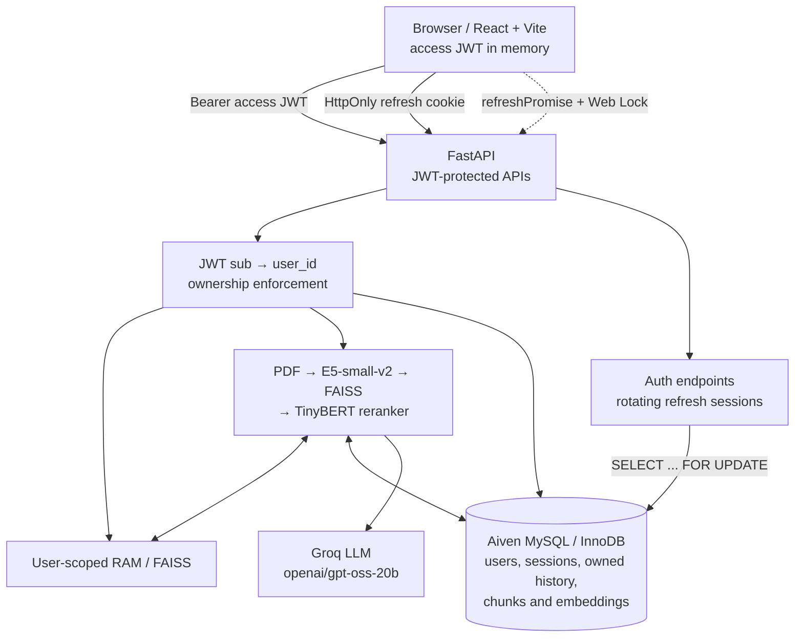

# Intelligent Document Query Engine - Full-Stack RAG Document QA

Live demo: https://shreerangss-intelligent-document-query-engine.hf.space/


## Overview

Intelligent Document Query Engine is a production-deployed, multi-user PDF
question-answering application. A React/Vite client sends authenticated requests
to FastAPI, which parses and chunks PDFs, retrieves and reranks relevant evidence,
uses Groq to generate grounded answers, and returns page/chunk citations. Users
have private document and query history backed by Aiven MySQL.

The project combines an evaluated RAG pipeline with production authentication,
explicit ownership checks, restart-safe embedding persistence, and a same-origin
deployment on Hugging Face Spaces. E5-small-v2 is the default embedding model;
MiniLM remains available as a benchmark baseline.

## What the System Demonstrates

- React/Vite authentication lifecycle with the access JWT held only in memory,
  automatic session restoration, and refresh-and-retry-once behavior.
- FastAPI APIs protected by short-lived JWTs and explicit user-scoped
  authorization for documents, chunks, queries, citations, and history.
- Email/password authentication with Argon2id password hashing, ten-minute HS256
  access JWTs, opaque rotating refresh tokens, and logout/session revocation.
- Layered refresh concurrency control: a same-tab `refreshPromise`, the browser
  Web Locks API across tabs, and MySQL/InnoDB row locks on the server.
- PDF URL and upload ingestion, PyMuPDF extraction, page-aware chunking,
  E5-small-v2 embeddings, FAISS retrieval, TinyBERT CrossEncoder reranking, and
  Groq generation with evidence and citations.
- MySQL-persisted float32 embeddings and request-id recovery, allowing upload
  FAISS indexes and committed responses to be reconstructed after a restart.
- Retrieval evaluation across lexical, paraphrase, conceptual, and distractor
  questions, with MiniLM and hybrid-search comparisons.

## Architecture


```mermaid
flowchart TD
    Browser["Browser / React + Vite<br/>access JWT in memory"]
    API["FastAPI<br/>JWT-protected APIs"]
    Identity["JWT sub → user_id<br/>ownership enforcement"]
    Auth["Auth endpoints<br/>rotating refresh sessions"]
    Cache["User-scoped RAM / FAISS"]
    RAG["PDF → E5-small-v2 → FAISS<br/>→ TinyBERT reranker"]
    DB[("Aiven MySQL / InnoDB<br/>users, sessions, owned history,<br/>chunks and embeddings")]
    Groq["Groq LLM<br/>openai/gpt-oss-20b"]

    Browser -->|"Bearer access JWT"| API
    Browser -->|"HttpOnly refresh cookie"| API
    Browser -. "refreshPromise + Web Lock" .-> API
    API --> Identity
    API --> Auth
    Identity --> Cache
    Identity --> RAG
    Identity --> DB
    Auth -->|"SELECT ... FOR UPDATE"| DB
    RAG <--> Cache
    RAG <--> DB
    RAG --> Groq
```

### Important Engineering Decisions

- **Authentication:** validated, normalized email addresses are stored directly
  on users. Passwords are hashed with Argon2id. Access tokens are HS256 JWTs with
  a 600-second default lifetime; refresh credentials are opaque and stored only
  as an `HttpOnly`, `Secure`, `SameSite=Lax` cookie. The database stores the
  refresh-token SHA-256 digest, never the raw token.
- **Refresh correctness:** callers in one tab share a single in-flight refresh;
  the stable `idqe-auth-refresh` Web Lock serializes refresh HTTP dispatch across
  same-origin tabs. InnoDB `SELECT ... FOR UPDATE` is the final correctness layer,
  preventing a refresh session from branching during rotation.
- **Authorization:** the validated JWT `sub` is the canonical `user_id` for RAG
  and history requests. Persistent rows and RAM/FAISS entries are user-scoped.
  Access to another user's private resource uses not-found behavior rather than
  revealing that the resource exists.
- **Recovery:** uploads check user-scoped RAM first, then persisted MySQL chunks
  and embeddings, and only re-parse/re-embed on a full miss. A committed upload
  can also be recovered safely by its optional `request_id`.
- **Browser security:** production uses an enforcing Content Security Policy and
  React's normal safe text rendering. The CSP contains neither `unsafe-inline`
  nor `unsafe-eval`; cookie-backed auth POSTs also enforce origin/referer checks.

## Retrieval Evaluation

The retrieval pipeline was evaluated on a fixed financial-document benchmark:

- 33 labeled questions across Infosys, HDFC Bank, and Bajaj Finance annual reports.
- Question types: lexical, paraphrase, conceptual, and distractor.
- Metrics: Recall@3, Recall@5, MRR, needs_review count, retrieval latency, and ingestion/indexing time.
- Evaluation mode: retrieval-only, no LLM answer generation.

Final retrieval metrics:

| Configuration | R@3 | R@5 | MRR | needs_review | p50 | p95 | ingest/index time |
| --- | ---: | ---: | ---: | ---: | ---: | ---: | ---: |
| MiniLM | 54.2% | 62.5% | 0.474 | 7 | 56 ms | 144 ms | 230.8s |
| E5-small-v2 | 58.3% | 70.8% | 0.496 | 4 | 73 ms | 156 ms | 534.0s |
| E5+BM25 hybrid | 58.3% | 70.8% | 0.504 | 5 | 216 ms | 527 ms | 510.0s |

Decision summary:

- E5-small-v2 improves retrieval quality over the MiniLM baseline, raising R@5 from 62.5% to 70.8% and reducing needs_review from 7 to 4.
- E5-small-v2 is especially helpful on paraphrase and conceptual questions.
- E5+BM25 hybrid rescued one exact table case but did not improve R@5, increased needs_review from 4 to 5, and tripled p50 retrieval latency, so it remains a documented ablation rather than the default.
- Larger embedding candidates were rejected for this environment: GTE was slower and worse than E5, and Qwen3-0.6B CPU ingestion was impractically slow.
- Remaining misses are documented limitations around table extraction, candidate-pool size, reranker ordering, and benchmark hit criteria.

See [docs/retrieval_evaluation.md](docs/retrieval_evaluation.md) for the detailed evaluation summary.

Authentication, MySQL/InnoDB, migration-rehearsal, and production configuration
gates are documented in
[docs/production_readiness.md](docs/production_readiness.md).

## Configuration

Backend variables referenced by the code:

| Variable | Required | Default | Purpose |
| --- | --- | --- | --- |
| `API_TOKEN` | `/health/db` only | none | Separate operational bearer token loaded lazily by the sensitive database diagnostic. It is not an application-user identity. |
| `ACCESS_JWT_SECRET` | Yes | none | HS256 signing secret of at least 32 bytes for user access JWTs. |
| `ACCESS_TOKEN_TTL_SECONDS` | No | `600` | Short-lived access-token lifetime in seconds. |
| `REFRESH_COOKIE_SECURE` | No | `true` | Controls the refresh cookie's `Secure` attribute. Set explicitly to `false` only for plain-HTTP localhost development. |
| `AUTH_ALLOWED_ORIGINS` | No | none | Comma-separated exact browser origins additionally accepted by auth POST origin checks. Set the public origin when a reverse proxy changes the backend-observed origin. Documented localhost origins are accepted automatically; wildcards are rejected. |
| `GROQ_API_KEY` | Yes | none | Used by the Groq SDK for answer generation and claim verification. |
| `DATABASE_URL` | Production | `sqlite:///./rag_persistence.db` | SQLAlchemy URL for users, refresh sessions, owned RAG history, chunks, and embeddings. Production uses Aiven MySQL. |
| `DB_CA_CERT` | Local MySQL | none | Local path to the MySQL CA certificate for TLS verification. Do not commit this file. |
| `DB_CA_CERT_B64` | HF MySQL | none | Base64-encoded CA certificate secret decoded at startup for Hugging Face deployment. |
| `DB_ALLOW_LOCAL_TEST_CERT_HOSTNAME_MISMATCH` | Local disposable MySQL only | `false` | Keeps CA/signature validation but permits MySQL Community Server's auto-generated certificate without a hostname. Rejected unless the host is loopback and the database name identifies a test/disposable database. Never set in production. |
| `PORT` | No | `7860` | Uvicorn port used by `start.py`. |
| `MAX_PDF_BYTES` | No | `15728640` | Maximum PDF size in bytes. |
| `HTTP_TIMEOUT_SECONDS` | No | `30` | Timeout for PDF URL downloads. |
| `RETRIEVAL_K_INITIAL` | No | `20` | Initial FAISS retrieval count before reranking in the app path. |
| `RETRIEVAL_K_FINAL` | No | `8` | Final chunk count after reranking in the app path. |
| `RETRIEVAL_MODE` | No | `faiss_reranker` | Retrieval path. Experimental option: `e5_bm25_reranker`. |
| `HYBRID_E5_K_INITIAL` | No | `30` | E5 candidate count for the hybrid experiment. |
| `HYBRID_BM25_K_INITIAL` | No | `20` | BM25 candidate count for the hybrid experiment. |
| `HYBRID_K_FINAL` | No | `5` | Final reranked chunk count for the hybrid experiment. |
| `MAX_CONCURRENT_QUESTIONS` | No | `4` | Concurrent question processing limit. |
| `DOCUMENT_CACHE_MAX_ITEMS` | No | `8` | Maximum number of cached document indexes. |
| `DOCUMENT_CACHE_TTL_SECONDS` | No | `3600` | Document cache TTL in seconds. |
| `EMBEDDING_MODEL_NAME` | No | `intfloat/e5-small-v2` | Hugging Face embedding model name. Set `all-MiniLM-L6-v2` to use the MiniLM fallback/baseline. |
| `RERANKER_MODEL_NAME` | No | `cross-encoder/ms-marco-TinyBERT-L-2-v2` | CrossEncoder reranker model name. |
| `LLM_MODEL_NAME` | No | `openai/gpt-oss-20b` | Groq model name. |

Frontend variable:

| Variable | Required | Default | Purpose |
| --- | --- | --- | --- |
| `VITE_API_BASE_URL` | No | same origin | Optional API base URL for local Vite development. |

## Local Development

Backend:

```powershell
py -m venv .venv
.venv\Scripts\Activate.ps1
pip install --upgrade pip
pip install torch --index-url https://download.pytorch.org/whl/cpu
pip install -r requirements.txt
$env:GROQ_API_KEY="your_groq_api_key"
$env:API_TOKEN="your_operational_health_token"
$env:ACCESS_JWT_SECRET="replace-with-at-least-32-random-bytes"
$env:REFRESH_COOKIE_SECURE="false"
$env:DATABASE_URL="mysql+pymysql://..."
$env:DB_CA_CERT="certs/ca.pem"
$env:PORT="7860"
py start.py
```

Frontend:

```powershell
cd frontend
copy .env.example .env
npm install
npm run dev
```

Local Vite development uses the same-origin proxy for `/auth`, `/hackrx`,
`/history`, and `/health` by default. Leave `VITE_API_BASE_URL` empty unless a
direct backend origin is specifically required; the proxy most closely matches
production refresh-cookie behavior.

## Evaluation Commands

MiniLM baseline:

```powershell
$env:EMBEDDING_MODEL_NAME='all-MiniLM-L6-v2'
.venv\Scripts\python.exe eval\runner.py --no-llm --out eval\results\stage2d_minilm
```

E5-small-v2:

```powershell
$env:EMBEDDING_MODEL_NAME='intfloat/e5-small-v2'
.venv\Scripts\python.exe eval\runner.py --no-llm --out eval\results\stage2d_e5_small_v2
```

E5+BM25 hybrid ablation:

```powershell
$env:EMBEDDING_MODEL_NAME='intfloat/e5-small-v2'
$env:RETRIEVAL_MODE='e5_bm25_reranker'
.venv\Scripts\python.exe eval\runner.py --no-llm --out eval\results\stage2e_e5_bm25_hybrid
```

Generated files under `eval/results/` are ignored by git. Commit lightweight summaries under `docs/` instead.

## Docker / Hugging Face Spaces Deployment

The Dockerfile builds the frontend with Node 20, then creates a Python runtime image. It installs CPU-only PyTorch and Python dependencies, copies the built frontend into `frontend/dist`, exposes port `7860`, and runs `python start.py`.

Build and run locally:

```powershell
docker build -t intelligent-document-query-engine .
docker run --rm -p 7860:7860 `
  --env GROQ_API_KEY=your_groq_api_key `
  --env API_TOKEN=your_operational_health_token `
  --env ACCESS_JWT_SECRET=replace-with-at-least-32-random-bytes `
  --env DATABASE_URL=your_database_url `
  --env DB_CA_CERT_B64=your_base64_encoded_ca_certificate `
  intelligent-document-query-engine
```

For Hugging Face Spaces:

- Use the Docker SDK.
- Configure `DATABASE_URL`, `DB_CA_CERT_B64`, `GROQ_API_KEY`,
  `ACCESS_JWT_SECRET`, and the operational `API_TOKEN` as Space secrets.
- Set `AUTH_ALLOWED_ORIGINS` to the exact public Space origin when required by
  the hosting proxy; it is configuration, not a secret.
- Store the MySQL/Aiven CA certificate as `DB_CA_CERT_B64`; do not commit `certs/*.pem`.
- Keep `app_port: 7860` in the README front matter.
- The built React frontend is served by FastAPI from the same origin.
- The live Hugging Face Space uses Aiven MySQL over verified TLS and serves the
  production React build and API from one origin.

## API Surface

### Authentication endpoints

| Method and route | Purpose |
| --- | --- |
| `POST /auth/register` | Normalize email, create a password account, and start a session. |
| `POST /auth/login` | Verify credentials and start a session. |
| `POST /auth/refresh` | Rotate the browser-managed refresh credential and issue a new access JWT. |
| `POST /auth/logout` | Revoke and clear the current refresh session. |
| `GET /auth/me` | Return the current user's public account fields. |

Registration, login, and refresh return a ten-minute access JWT in JSON. The
opaque refresh credential is confined to the host-only `idqe_refresh` cookie
with `HttpOnly`, `Secure`, `SameSite=Lax`, and `Path=/auth`. The React client
keeps each tab's access JWT in memory, restores sessions on page load, and
retries an authenticated request at most once after refresh. It never reads the
refresh cookie or persists/shares an access token.

### RAG and history endpoints

| Method and route | Purpose |
| --- | --- |
| `POST /hackrx/run` | Run the RAG pipeline against a PDF URL. |
| `POST /hackrx/upload-run` | Run the pipeline against an uploaded PDF; accepts an optional idempotent `request_id`. |
| `GET /history/documents` | List documents owned by the JWT subject. |
| `GET /history/documents/{document_id}/queries` | List queries for an owned document. |
| `GET /history/queries/{query_id}/citations` | Return citations for an owned query. |

All of these routes require `Authorization: Bearer <access JWT>`. Ownership is
derived exclusively from the validated JWT subject. A private document or query
owned by someone else is returned as not found.

Example URL request:

```json
{
  "documents": "https://example.com/document.pdf",
  "questions": [
    "What is this document about?",
    "What are the key exclusions?"
  ]
}
```

The upload route accepts these multipart fields:

- `file`: PDF file upload.
- `questions_json`: JSON array of question strings.
- `request_id`: optional client-generated UUID used to recover a successfully
  committed response after a lost HTTP response.

For uploads, the cache order is RAM, then MySQL chunks/embeddings, then complete
PDF extraction and embedding. A committed `request_id` retry returns the stored
answer without rerunning the RAG pipeline. Reusing an ID with different
questions or a different PDF returns HTTP 409.

### Operational endpoints

- `GET /health` exposes non-sensitive service and model/cache readiness.
- `GET /health/db` performs a safe database connectivity check and is the only
  route protected by the separate operational `API_TOKEN`. User access JWTs do
  not grant access to it.

## Security Notes

- Do not commit `.env`, `.env.local`, or real API keys.
- Do not commit database credentials or CA certificates.
- Passwords use Argon2id; raw passwords and refresh tokens are never stored.
- Access JWTs are short-lived and held only in frontend memory. Refresh tokens
  are browser-managed `HttpOnly` cookies backed by revocable database sessions.
- Query and history endpoints require an access JWT. The operational
  `API_TOKEN` is separate from user authentication and applies only to
  `/health/db`.
- Cookie-backed auth POSTs reject untrusted browser origins using `Origin` or
  `Referer` validation in addition to `SameSite=Lax` cookie behavior.
- Production sends an enforcing CSP covering scripts, styles, images, fonts,
  connections, frames, forms, objects, and base URIs. It allows neither
  `unsafe-inline` nor `unsafe-eval`; React renders model and document text as
  text rather than executable HTML.
- Auth responses containing credentials use `Cache-Control: no-store`; raw
  refresh tokens never appear in JSON.
- URL ingestion downloads caller-provided PDFs, so deployment environments should consider network egress and SSRF risk policies.

## Persistence and Schema

Production persistence uses Aiven MySQL/InnoDB over verified TLS. The schema
contains users, rotating `refresh_sessions`, user-owned documents/chunks/
queries/citations, persisted embeddings, and upload `request_id` idempotency.
Foreign keys and ownership-aware queries keep account data isolated.

The idempotent MySQL migrations are retained in numeric order under
`migrations/mysql/`. Migration 001 adds persisted embeddings and request
recovery; migration 002 introduces the production multi-user authentication
schema and cleans obsolete placeholder-era data. Both have dedicated guarded
rehearsal and real-MySQL integration coverage. New databases are initialized
without seeded user identities. Schema details and verification queries live in
[`docs/persistence_schema.md`](docs/persistence_schema.md); operational gates are
in [`docs/production_readiness.md`](docs/production_readiness.md).

## Limitations

- PDF extraction depends on embedded text; scanned/image-only PDFs are not OCR-processed.
- FAISS indexes remain in memory and are reconstructed from persisted upload
- In-memory caches are process-local, bounded, and cleared on restart; their
  keys include user identity so cached artifacts cannot cross account scopes.
- Retrieval quality is improved but not perfect; remaining misses are documented in the benchmark summary.

## Verification Commands

Backend tests and Python compilation:

```powershell
.venv\Scripts\python.exe -m pytest -q
.venv\Scripts\python.exe -m compileall -q main.py backend persistence eval scripts tests
.venv\Scripts\python.exe -m pip check
```

Frontend tests and production build:

```powershell
cd frontend
npm test
npm run build
```

Repository whitespace check:

```powershell
git diff --check
```
