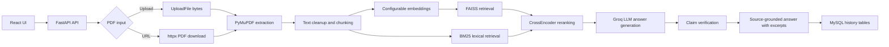

# Intelligent Document Query Engine - Full-Stack RAG Document QA

Live demo: https://shreerangss-intelligent-document-query-engine.hf.space/


## Overview

Intelligent Document Query Engine is a full-stack PDF RAG application with an evaluated retrieval pipeline and persistent document/query history. It combines a React/Vite frontend with a FastAPI backend that ingests PDFs from a URL or upload, chunks extracted text, retrieves relevant evidence, reranks it, asks Groq to generate source-grounded answers with page/chunk citations and claim verification, and stores history in managed MySQL.

The Hugging Face live demo is updated with persistence enabled. The app defaults to E5-small-v2 for retrieval quality. MiniLM remains selectable through `EMBEDDING_MODEL_NAME` for fallback/baseline comparison.

## Features

- React/Vite UI for PDF URL ingestion and PDF upload.
- Persistent document and query history backed by managed MySQL/Aiven.
- FastAPI API with bearer-token protection for query endpoints.
- PDF validation, download/upload handling, and PyMuPDF text extraction.
- Page-aware chunking with 500-character chunks and 50-character overlap.
- Configurable embeddings through `EMBEDDING_MODEL_NAME`.
- E5-small-v2 default: `intfloat/e5-small-v2` with correct `passage:` and `query:` prefixes.
- MiniLM fallback/baseline: `all-MiniLM-L6-v2`.
- In-memory FAISS vector search with embedding-aware RAM cache keys.
- Persistent upload chunks and float32 E5 embeddings in MySQL, allowing FAISS
  reconstruction without re-embedding after a restart.
- Optional upload `request_id` recovery for committed responses.
- BM25 and E5+BM25 hybrid retrieval experiments behind `RETRIEVAL_MODE`.
- CrossEncoder reranking, defaulting to `cross-encoder/ms-marco-TinyBERT-L-2-v2`.
- Groq LLM answer generation, defaulting to `openai/gpt-oss-20b`.
- Source-grounded responses with page number, chunk id, and excerpts.
- Claim extraction and verification against retrieved evidence.
- Explicit user-scoped persistent document, chunk, query, citation, and recovery operations.
- Retrieval evaluation harness with benchmark reports and targeted probes.

## Architecture

`React UI -> FastAPI API -> RAM/MySQL artifact lookup -> PDF extraction on full miss -> chunking -> embeddings -> FAISS/BM25 retrieval experiments -> CrossEncoder reranking -> Groq LLM -> source-grounded answers + claim verification -> atomic MySQL persistence`


```mermaid
flowchart LR
    A[React UI] --> B[FastAPI API]
    B --> C{PDF input}
    C -->|Upload| D[UploadFile bytes]
    C -->|URL| E[httpx PDF download]
    D --> F[PyMuPDF extraction]
    E --> F
    F --> G[Text cleanup and chunking]
    G --> H[Configurable embeddings]
    H --> I[FAISS retrieval]
    G --> J[BM25 lexical retrieval]
    I --> K[CrossEncoder reranking]
    J --> K
    K --> L[Groq LLM answer generation]
    L --> M[Claim verification]
    M --> N[Source-grounded answer with excerpts]
    N --> O[MySQL history tables]
```

## Retrieval Evaluation

The retrieval pipeline was evaluated on a fixed financial-document benchmark:

- 33 labeled questions across Infosys, HDFC Bank, and Bajaj Finance annual reports.
- Question types: lexical, paraphrase, conceptual, and distractor.
- Metrics: Recall@3, Recall@5, MRR, needs_review count, retrieval latency, and ingestion/indexing time.
- Evaluation mode: retrieval-only, no LLM answer generation.

Final retrieval metrics:

| Configuration | R@3 | R@5 | MRR | needs_review | p50 | p95 | ingest/index time |
| --- | ---: | ---: | ---: | ---: | ---: | ---: | ---: |
| MiniLM | 54.2% | 62.5% | 0.474 | 7 | 56 ms | 144 ms | 230.8s |
| E5-small-v2 | 58.3% | 70.8% | 0.496 | 4 | 73 ms | 156 ms | 534.0s |
| E5+BM25 hybrid | 58.3% | 70.8% | 0.504 | 5 | 216 ms | 527 ms | 510.0s |

Decision summary:

- E5-small-v2 improves retrieval quality over the MiniLM baseline, raising R@5 from 62.5% to 70.8% and reducing needs_review from 7 to 4.
- E5-small-v2 is especially helpful on paraphrase and conceptual questions.
- E5+BM25 hybrid rescued one exact table case but did not improve R@5, increased needs_review from 4 to 5, and tripled p50 retrieval latency, so it remains a documented ablation rather than the default.
- Larger embedding candidates were rejected for this environment: GTE was slower and worse than E5, and Qwen3-0.6B CPU ingestion was impractically slow.
- Remaining misses are documented limitations around table extraction, candidate-pool size, reranker ordering, and benchmark hit criteria.

See [docs/retrieval_evaluation.md](docs/retrieval_evaluation.md) for the detailed evaluation summary.

Authentication, MySQL/InnoDB, migration-rehearsal, and production configuration
gates are documented in
[docs/production_readiness.md](docs/production_readiness.md).

## Configuration

Backend variables referenced by the code:

| Variable | Required | Default | Purpose |
| --- | --- | --- | --- |
| `API_TOKEN` | `/health/db` only | none | Separate operational bearer token loaded lazily by the sensitive database diagnostic. It is not an application-user identity. |
| `ACCESS_JWT_SECRET` | Yes | none | HS256 signing secret of at least 32 bytes for user access JWTs. |
| `ACCESS_TOKEN_TTL_SECONDS` | No | `600` | Short-lived access-token lifetime in seconds. |
| `REFRESH_COOKIE_SECURE` | No | `true` | Controls the refresh cookie's `Secure` attribute. Set explicitly to `false` only for plain-HTTP localhost development. |
| `AUTH_ALLOWED_ORIGINS` | No | none | Optional comma-separated additional browser origins accepted by auth POST origin checks. Same-origin requests and the documented localhost frontend origins are accepted automatically. Wildcards are not supported. |
| `GROQ_API_KEY` | Yes | none | Used by the Groq SDK for answer generation and claim verification. |
| `DATABASE_URL` | Production | `sqlite:///./rag_persistence.db` | SQLAlchemy database URL for persisted users, documents, chunks, queries, and citations. Production uses managed MySQL/Aiven. |
| `DB_CA_CERT` | Local MySQL | none | Local path to the MySQL CA certificate for TLS verification. Do not commit this file. |
| `DB_CA_CERT_B64` | HF MySQL | none | Base64-encoded CA certificate secret decoded at startup for Hugging Face deployment. |
| `DB_ALLOW_LOCAL_TEST_CERT_HOSTNAME_MISMATCH` | Local disposable MySQL only | `false` | Keeps CA/signature validation but permits MySQL Community Server's auto-generated certificate without a hostname. Rejected unless the host is loopback and the database name identifies a test/disposable database. Never set in production. |
| `PORT` | No | `7860` | Uvicorn port used by `start.py`. |
| `MAX_PDF_BYTES` | No | `15728640` | Maximum PDF size in bytes. |
| `HTTP_TIMEOUT_SECONDS` | No | `30` | Timeout for PDF URL downloads. |
| `RETRIEVAL_K_INITIAL` | No | `20` | Initial FAISS retrieval count before reranking in the app path. |
| `RETRIEVAL_K_FINAL` | No | `8` | Final chunk count after reranking in the app path. |
| `RETRIEVAL_MODE` | No | `faiss_reranker` | Retrieval path. Experimental option: `e5_bm25_reranker`. |
| `HYBRID_E5_K_INITIAL` | No | `30` | E5 candidate count for the hybrid experiment. |
| `HYBRID_BM25_K_INITIAL` | No | `20` | BM25 candidate count for the hybrid experiment. |
| `HYBRID_K_FINAL` | No | `5` | Final reranked chunk count for the hybrid experiment. |
| `MAX_CONCURRENT_QUESTIONS` | No | `4` | Concurrent question processing limit. |
| `DOCUMENT_CACHE_MAX_ITEMS` | No | `8` | Maximum number of cached document indexes. |
| `DOCUMENT_CACHE_TTL_SECONDS` | No | `3600` | Document cache TTL in seconds. |
| `EMBEDDING_MODEL_NAME` | No | `intfloat/e5-small-v2` | Hugging Face embedding model name. Set `all-MiniLM-L6-v2` to use the MiniLM fallback/baseline. |
| `RERANKER_MODEL_NAME` | No | `cross-encoder/ms-marco-TinyBERT-L-2-v2` | CrossEncoder reranker model name. |
| `LLM_MODEL_NAME` | No | `openai/gpt-oss-20b` | Groq model name. |

Frontend variable:

| Variable | Required | Default | Purpose |
| --- | --- | --- | --- |
| `VITE_API_BASE_URL` | No | same origin | Optional API base URL for local Vite development. |

## Local Development

Backend:

```powershell
py -m venv .venv
.venv\Scripts\Activate.ps1
pip install --upgrade pip
pip install torch --index-url https://download.pytorch.org/whl/cpu
pip install -r requirements.txt
$env:GROQ_API_KEY="your_groq_api_key"
$env:API_TOKEN="your_operational_health_token"
$env:ACCESS_JWT_SECRET="replace-with-at-least-32-random-bytes"
$env:REFRESH_COOKIE_SECURE="false"
$env:DATABASE_URL="mysql+pymysql://..."
$env:DB_CA_CERT="certs/ca.pem"
$env:PORT="7860"
py start.py
```

Frontend:

```powershell
cd frontend
copy .env.example .env
npm install
npm run dev
```

Local Vite development uses the same-origin proxy for `/auth`, `/hackrx`,
`/history`, and `/health` by default. Leave `VITE_API_BASE_URL` empty unless a
direct backend origin is specifically required; the proxy most closely matches
production refresh-cookie behavior.

## Evaluation Commands

MiniLM baseline:

```powershell
$env:EMBEDDING_MODEL_NAME='all-MiniLM-L6-v2'
.venv\Scripts\python.exe eval\runner.py --no-llm --out eval\results\stage2d_minilm
```

E5-small-v2:

```powershell
$env:EMBEDDING_MODEL_NAME='intfloat/e5-small-v2'
.venv\Scripts\python.exe eval\runner.py --no-llm --out eval\results\stage2d_e5_small_v2
```

E5+BM25 hybrid ablation:

```powershell
$env:EMBEDDING_MODEL_NAME='intfloat/e5-small-v2'
$env:RETRIEVAL_MODE='e5_bm25_reranker'
.venv\Scripts\python.exe eval\runner.py --no-llm --out eval\results\stage2e_e5_bm25_hybrid
```

Generated files under `eval/results/` are ignored by git. Commit lightweight summaries under `docs/` instead.

## Docker / Hugging Face Spaces Deployment

The Dockerfile builds the frontend with Node 20, then creates a Python runtime image. It installs CPU-only PyTorch and Python dependencies, copies the built frontend into `frontend/dist`, exposes port `7860`, and runs `python start.py`.

Build and run locally:

```powershell
docker build -t intelligent-document-query-engine .
docker run --rm -p 7860:7860 `
  --env GROQ_API_KEY=your_groq_api_key `
  --env API_TOKEN=your_operational_health_token `
  --env ACCESS_JWT_SECRET=replace-with-at-least-32-random-bytes `
  --env DATABASE_URL=your_database_url `
  --env DB_CA_CERT=/path/to/ca.pem `
  intelligent-document-query-engine
```

For Hugging Face Spaces:

- Use the Docker SDK.
- Configure `DATABASE_URL`, `DB_CA_CERT_B64`, `GROQ_API_KEY`, `ACCESS_JWT_SECRET`, and the operational `API_TOKEN` as Space secrets.
- Store the MySQL/Aiven CA certificate as `DB_CA_CERT_B64`; do not commit `certs/*.pem`.
- Keep `app_port: 7860` in the README front matter.
- The built React frontend is served by FastAPI from the same origin.
- The live Hugging Face Space at https://shreerangss-intelligent-document-query-engine.hf.space/ is manually deployed and currently includes persistence.
- OAuth is not implemented. Password-authenticated users and JWT-owned
  RAG/history operations are supported.

## API Endpoints

### Authentication endpoints

`POST /auth/register`, `POST /auth/login`, and `POST /auth/refresh` return a
ten-minute access JWT in JSON and set the opaque refresh credential only in the
host-only `idqe_refresh` cookie. The cookie is `HttpOnly`, `SameSite=Lax`, uses
`Path=/auth`, and is `Secure` by default. `POST /auth/logout` revokes and clears
only the current browser session. `GET /auth/me` uses the DB-backed access-token
dependency and returns only public user fields.

All auth POSTs validate browser `Origin` (or `Referer`) against the request
origin, the explicit `AUTH_ALLOWED_ORIGINS` list, and the supported localhost
frontend origins. Requests identified as cross-site are rejected; non-browser
clients without browser origin metadata remain supported. This check is in
addition to CORS and `SameSite`, not a replacement for either.

The React auth provider keeps `status`, `accessToken`, and `user` in JavaScript
module memory only. On page load it renders a loading state while one raw
`POST /auth/refresh` attempts to restore the session. Login, registration,
refresh, and logout always use raw cookie-enabled requests, so refresh itself
cannot enter the normal 401 retry path.

Authenticated requests share one in-flight refresh promise per tab. Concurrent
401 responses wait for that promise and retry their original request exactly
once with the replacement access token. The actual refresh HTTP dispatch also
runs inside the same-origin Web Lock named `idqe-auth-refresh`, serializing
refresh-cookie rotation across tabs and windows. The request is constructed
inside the lock callback so a waiting tab uses the latest browser-managed
cookie. The JWT is never written to browser storage or a cookie. The refresh
cookie remains `HttpOnly` and is never read by frontend code.

The RAG and history clients use the same `authenticatedFetch()` path. Access
JWTs come from the in-memory auth session, and a genuine authentication 401
uses the existing refresh-and-retry-once lifecycle.

Each tab retains its own in-memory access JWT and same-tab single-flight
promise, while the browser profile shares the refresh cookie and Web Lock.
Access JWTs are not shared between tabs. If Web Locks are unavailable, the
client falls back to the same-tab promise without polling, timers, storage
locks, or token sharing; cross-tab simultaneous refresh then remains a UX edge
case. Database `SELECT ... FOR UPDATE` remains the final server-side rotation
correctness layer.

### `POST /hackrx/run`

Runs the RAG pipeline against a PDF available by URL.

Headers:

```http
Authorization: Bearer <access JWT>
Content-Type: application/json
```

Request body:

```json
{
  "documents": "https://example.com/document.pdf",
  "questions": [
    "What is this document about?",
    "What are the key exclusions?"
  ]
}
```

### `POST /hackrx/upload-run`

Runs the RAG pipeline against an uploaded PDF.

Headers:

```http
Authorization: Bearer <access JWT>
```

Multipart form fields:

- `file`: PDF file upload.
- `questions_json`: JSON array of question strings.
- `request_id`: optional client-generated UUID used to recover a successfully
  committed response after a lost HTTP response.

For uploads, the cache order is RAM, then MySQL chunks/embeddings, then complete
PDF extraction and embedding. A committed `request_id` retry returns the stored
answer without rerunning the RAG pipeline. Reusing an ID with different
questions or a different PDF returns HTTP 409.

### `GET /health`

Returns service status, app version, cache entry count, and whether the embedding model, reranker, and Groq client have been loaded.

### `GET /health/db`

Protected by the separate operational `Authorization: Bearer <API_TOKEN>`.
Runs only a safe database connectivity check. Application-user JWTs do not
grant access to this diagnostic, and the response exposes no database host,
credentials, or certificate data.

### `GET /history/documents`

Protected by `Authorization: Bearer <access JWT>`. Returns only documents owned by the JWT subject, including chunk and query counts.

### `GET /history/documents/{document_id}/queries`

Protected by `Authorization: Bearer <access JWT>`. Returns questions, answers, abstention status, and latency only when the document belongs to the JWT subject.

### `GET /history/queries/{query_id}/citations`

Protected by `Authorization: Bearer <access JWT>`. Returns persisted source citations only for a query owned by the JWT subject.

## Security Notes

- Do not commit `.env`, `.env.local`, or real API keys.
- Do not commit database credentials or CA certificates.
- Store `DATABASE_URL`, `DB_CA_CERT_B64`, `GROQ_API_KEY`, `ACCESS_JWT_SECRET`, and the operational `API_TOKEN` as Hugging Face Space secrets in production.
- Query and history endpoints require an access JWT. `/health/db` separately requires the operational `API_TOKEN`.
- Auth responses containing credentials use `Cache-Control: no-store`; raw refresh tokens never appear in JSON.
- Document indexes and model clients are process-local and in memory.
- URL ingestion downloads caller-provided PDFs, so deployment environments should consider network egress and SSRF risk policies.

## Existing Database Migration

Before deploying this version against an existing Aiven MySQL database, run the
idempotent migrations in numeric order, including
`migrations/mysql/001_persistent_embeddings_and_request_recovery.sql` and
`migrations/mysql/002_multi_user_auth.sql`. Migration 002 intentionally deletes
the disposable `local-dev-user` history. Detailed instructions and verification queries are in
[`docs/persistence_schema.md`](docs/persistence_schema.md#aiven-mysql-migration).
Running `scripts/init_db.py` alone is not sufficient because SQLAlchemy
`create_all()` does not alter existing tables.

## Limitations

- The first cache level is process-local memory and is cleared on container
  restart; upload FAISS indexes are then rebuilt from persisted embeddings.
- PDF extraction depends on embedded text; scanned/image-only PDFs are not OCR-processed.
- FAISS indexes remain in memory and are reconstructed from persisted upload
  embeddings after a restart. URL-only ingestion retains its existing behavior.
- Persistent RAG helpers require an explicit existing `user_id` and enforce
  database ownership. RAM document and FAISS entries are also keyed by an
  explicit structural `(user_id, resource_key)` identity. RAG/history routes
  supply that identity exclusively from the validated access-JWT subject.
- Retrieval quality is improved but not perfect; remaining misses are documented in the benchmark summary.

## Lightweight Checks

Compile changed Python files:

```powershell
.venv\Scripts\python.exe -m py_compile main.py eval\pipeline_adapter.py eval\runner.py eval\smoke_test.py
```

Run the metric unit tests:

```powershell
.venv\Scripts\python.exe -m pytest eval\test_metrics.py -q
```
