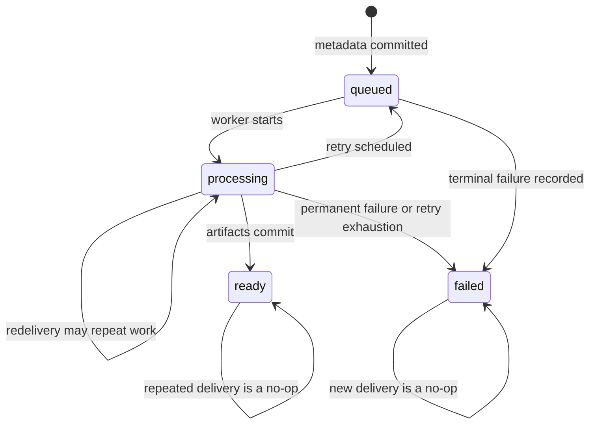
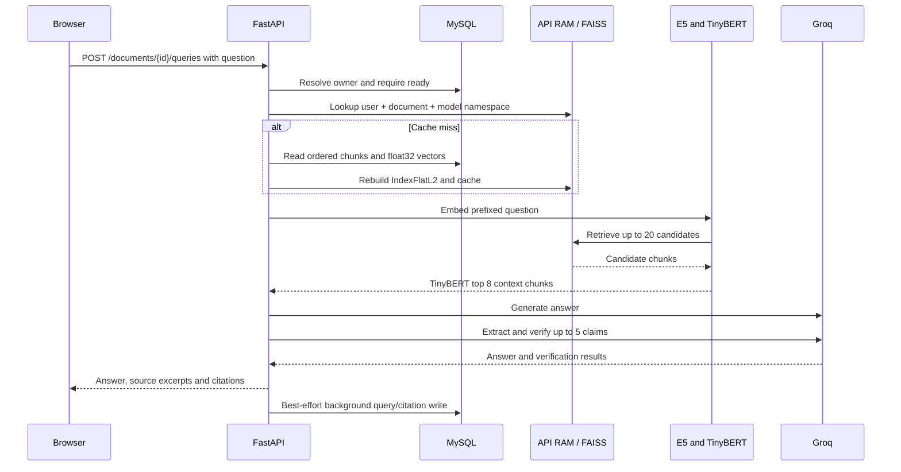

# Architecture and data flow

The primary browser upload flow separates HTTP acceptance from CPU-heavy PDF parsing and embedding. FastAPI stores a source object and document row, Celery processes the document, and the browser polls until it can query. The legacy `/hackrx/*` routes still perform synchronous ingestion/query work.

## Components and deployment boundaries

| Component | Responsibility | Lifetime / authority |
| --- | --- | --- |
| React/Vite | Authentication, PDF selection, status polling, duplicate choice, questions and history | Browser state; access JWT and pending upload UUID are in memory |
| FastAPI | Authentication/ownership checks, upload acceptance, task publication, ready-document queries | API process; serves the built frontend in production |
| S3-compatible storage | Original PDF bytes | Backblaze B2 in the reported production topology; local filesystem in development |
| MySQL | Users, refresh sessions, document state, chunks, embeddings, query/citation history | Aiven in production; authoritative application state |
| RabbitMQ / Celery | Delivery and execution of ingestion jobs | CloudAMQP in production; messages carry a document ID |
| PyMuPDF / E5 | Extract text, create page-aware chunks, compute vectors | Worker process; models loaded lazily |
| FAISS / TinyBERT | Per-document candidate retrieval and reranking | API RAM; rebuilt from stored vectors |
| Groq | Generate answers, extract claims, assess evidence | External inference boundary; receives selected document text |

Provider assignments above describe the current deployment supplied by the project owner, supported by the Docker, SQLAlchemy, broker and S3 adapters. They are not a live audit of provider settings, bucket policy, or backups. No private infrastructure values are needed in this repository.

The HF Docker container runs `production_start.py`, which starts the API (`start.py`) and a concurrency-1 Celery worker. FastAPI serves the Vite production build. Sharing a container reduces deployment overhead but couples resource use and restarts. Local Compose uses separate API and worker containers and an explicit RabbitMQ service. See [deployment](deployment.md).

## Async upload sequence

```mermaid
sequenceDiagram
    participant UI as Browser
    participant API as FastAPI
    participant Store as Private object storage
    participant DB as MySQL
    participant MQ as RabbitMQ
    participant Worker as Celery worker
    UI->>API: PDF + upload_request_id + allow_duplicate
    API->>API: Validate input and SHA-256 bytes
    API->>DB: Recover owned request UUID first
    alt Committed request with matching bytes
        DB-->>API: Existing document and status
        opt Status is queued
            API->>MQ: Republish document_id
        end
        API-->>UI: Existing document (200 or 202)
    else New request
        opt allow_duplicate is false
            API->>DB: Find owned usable hash match
            DB-->>API: Match or none
        end
        alt Usable match and duplicates not allowed
            API-->>UI: 409 duplicate_document
        else Upload proceeds
            API->>Store: PUT documents/{uuid}/source.pdf
            API->>DB: Commit queued row and object metadata
            API->>MQ: Publish document_id with confirmation
            API-->>UI: 202 document_id, filename, status
            MQ-->>Worker: Deliver documents.ingest(document_id)
            Worker->>DB: Lock row and commit processing
            Worker->>Store: GET PDF by stored object key
            Worker->>Worker: Validate size; parse, chunk, embed
            Worker->>DB: Commit chunks + float32 vectors + ready atomically
            Worker-->>MQ: Late acknowledgement
        end
    end
    UI->>API: GET /documents/{id}
    API->>DB: Owned status lookup
    API-->>UI: Lifecycle status
```

The diagram shows successful delivery. Storage PUT, metadata commit, and broker publication are separate operations. There is no transaction across the three systems. Reusing a request UUID with different bytes is a conflict before the duplicate-content check. Upload validation reads at most `MAX_PDF_BYTES + 1` bytes and checks the filename, content type, nonempty size and `%PDF-` signature; full parsing happens in the worker.

The source key uses a generated document UUID, not the filename or user identity. A metadata failure triggers best-effort deletion of the new object. The source remains after ingestion, including failed ingestion. The application neither makes objects public nor exposes a source viewing endpoint. Local durability depends on the mounted volume; production source durability depends on the configured object store and its policy.

## Lifecycle



These are normal transitions, not a lease protocol. Starting ingestion locks and updates the row briefly; it does not hold a lock during object reads or embedding. A second delivery can work on an already-processing document. Artifact persistence locks again, replaces chunks and commits `ready` together; an already-ready winner is preserved. A previously started successful invocation can still commit after another invocation recorded `failed`, because the final artifact transaction protects `ready` but does not reject `failed`. There is no active-attempt token or heartbeat.

A newly delivered task for a failed document does nothing. A fresh upload request can create a new document because content checks ignore failed matches. A retry of the failed document's original upload UUID recovers that failed document instead.

## Ready-document query sequence



The route checks ownership and lifecycle on every request, including cache hits. On a miss, the artifact loader requires matching embedding model/input format and contiguous chunk ordering, dtype and dimensions. It does not read the source object, call document embedding, or backfill legacy vectors. Missing or incompatible artifacts yield a safe 503. The query vector is still computed for each question.

Generation defaults to `openai/gpt-oss-20b`; verification retrieves evidence per extracted claim (normally 3 final chunks) and returns supported/weakly_supported/unsupported verdicts. Verification failure does not necessarily fail answer generation. Citations identify retrieved evidence, not independently certified truth. The experimental hybrid retrieval branch has its own candidate/final limits.

## Persistence and cache boundaries

The source PDF, relational metadata/artifacts, broker deliveries, and HTTP response have separate durability boundaries. [Failure modes](failure_modes.md) describes each gap. In particular, query/citation history is a best-effort side effect for both ready-document queries and the URL route; it is not committed atomically with returning an answer.

`DocumentCacheKey(user_id, resource_key)` and an owner stored on each cache entry protect against cross-user cache reuse. Async queries include document ID and embedding namespace in `resource_key`; synchronous paths use a URL/bytes-derived key and model namespace. Intentional duplicate documents therefore have distinct async query entries.

The document cache is bounded by entry count (8 by default), uses creation-based TTL (3,600 seconds), and evicts LRU entries at capacity. Reads update access time but do not extend the TTL. Expiration is checked during cache operations/health requests, not by a timer. Cache size is shared across users within one process. Model caches are separate and are not controlled by the document-cache TTL. FAISS is neither stored as the source of truth nor shared between API processes.

## Ownership and trusted workers

HTTP requests derive `user_id` from a validated JWT `sub`, never from upload form fields or task arguments. Resource lookups include that owner and use not-found behavior for other users' identifiers. Query and citation writes recheck the parent owner. Database foreign keys support these relationships; authorization still depends on application queries rather than database row-level security.

The worker receives only a document ID and resolves the owning row and source metadata internally. Broker publishing rights and worker database/storage credentials are trusted infrastructure capabilities. This task interface is not a public user authorization API. [Security](security.md) describes the resulting trust boundary.
